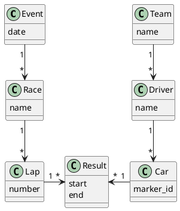

# Aruco  RC-Leaderboard

## Database schema

```puml
@startuml

class Event{
    date
}
class Race{
    name
}
class Lap{
    number
}

class Team{
    name
}
class Driver{
    name
}
class Car{
    marker_id
}

class Result{
    start
    end
}

Event "1" --> "*" Race
Race "1" --> "*" Lap
Team "1" --> "*" Driver
Driver "1" --> "*" Car
Car "1" -left-> "*" Result
Lap "1" -right-> "*" Result

@enduml
```

