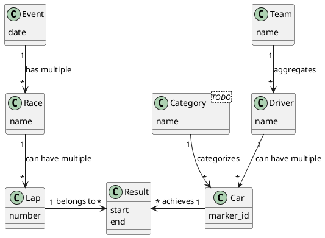

# Aruco  RC-Leaderboard
[TOC]
## Database schema




## Setup instructions
- download the latest version of [rasbian](https://downloads.raspberrypi.org/raspbian_lite_latest) and flash it to the micro sd card (using a tool like [etcher](https://www.balena.io/etcher/)).
- inside the boot partition of the sdcard (the one available on windows) do the following:
    - create a empty text file called ```ssh```
    - if you want the pi to automatically connect to wifi edit the content of the file ```wpa_supplicant.conf```:
        - set the appropriate country code (most likely ```CH```)
        - edit the ssid (network name) to fit your wifi.
        - edit the psk (pre-shared key, password) to fit your wifi.
        - when done copy the file to the boot partition of your sdcard.
    - copy ```install.sh```, ```dphys-swapfile``` and ```aruco_leaderboard.service``` to the boot partition of your sdcard.
    - connect to the pi using ssh (PuTTY or the ssh commandline tool)
        - default username: pi
        - default password: raspberry
    - run ```sudo apt-get update```
    - run ```sudo apt-get dist-update```
    - run ```sudo rpi-update```
        - confirm with ```y``` when prompted
    - reboot the pi using ```sudo reboot```
    - after some seconds reconnect via ssh
    - run ```sudo mv /etc/dphys-swapfile /etc/dphys-swapfile.orig```
    - run ```sudo cp /boot/dphys-swapfile /etc/dphys-swapfile```
    - run ```sudo /etc/init.d/dphys-swapfile stop```
    - run ```sudo /etc/init.d/dphys-swapfile start```
    - run ```sudo /boot/install.sh``` (takes a while)
    - to check if everything worked run ```python3 -c "import cv2;print(cv2.__version__)"``` this should show the curernt opencv version number (example: 4.1.0-dev)
    - run ```sudo cp /boot/aruco_leaderboard.service /lib/systemd/system/aruco_leaderboard.service```
    - run ```sudo systemctl enable aruco_leaderboard.service```
    - run ```sudo systemctl start aruco_leaderboard.service```
    - using a webbrowser connect to the ip-address of the pi. this should show you the api-definition via swagger-ui


## Label generator
### Parameters
- **aruco_code_1** = integer[0-999]
- **aruco_code_2** = integer[0-999]
- **aruco_code_3** = integer[0-999]
- **aruco_code_4** = integer[0-999]
- **starting_number** = integer[0-999]
- **background_image** = image_path
    - if the image has a alpha(transparency) channel, it will be stretched to fill the whole image
    - if there is no transparency, the image will fill the space between top and bottom color bar
- **top_bar_color** = color (html color code or limited primary color name)
- **bottom_bar_color** = color (html color code)
### Installation:
- install python and opencv as described on [hellsurfer.ch](http://www.hellsurfer.ch)
- to get the code, there are two ways:
    1. install git and clone this repository
    2. download the zip archive from github
### Usage:
- open a command prompt inside the label_generator directory
- run ```python label_generator.py id1 id2 id3 id4 starting_number image_path top_color bottom_color output_path```
    - example ```python label_generator.py 1 23 45 678 678 ./testimage.png #1256f3 #1256f3 ./test_output.png```
